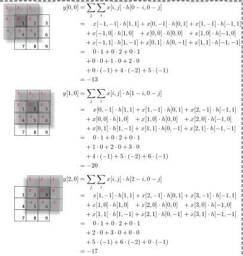
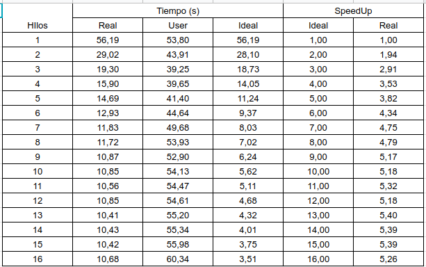
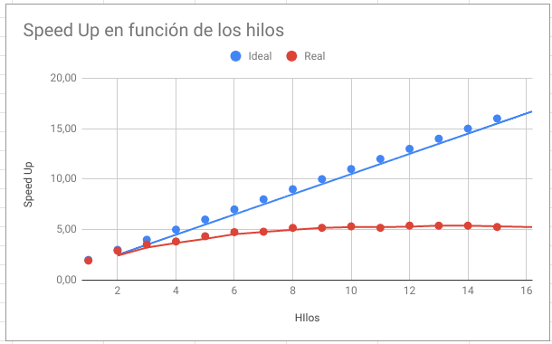

# Speed Up de algoritmo de Convolucion de imágenes .bmp en 2d

Alberto Cabuya\
Javier Cárdenas\
Brayan Roncancio\

## Resumen
En el presente documento se realizó la compararción del`Speed Up` teórica vs experimental de un algoritmo de convolución de imágenes con formato `.bmp` desde 1 hasta 16 hilos, en un computador con procesador `Intel Core i5-8300HQ` de 2.3Ghz de velocidad, con `4 núcleos físicos` y `8 virtuales`. El experimento se realizó con una imagen de 3552x2000 pixeles y con un filtro de desenfoque de orden 20. Sin embargo el código cuenta con funciones para implementar cualquier filtro de orden n y con cualquier imagen .bmp con formato y dimensiones wxh. Tambien se puede ejecutar con N hilos. Dentro de los resultados más importantes se econtró que el speed up fue `lineal` hasta 4 hilos que es el número de núcleos físicos de la máquina, tal como se esperó. El speed Up aumentó sutilmente hasta 8 hilos que es el número de núcleos virtuales de la máquina. De este número hasta 16 hilos, no hubo mayor cambio.

## Introduccion
La convolución que involucra señales unidimensionales se conoce como convolución 1D o simplemente convolución. De lo contrario, si la convolución se realiza entre dos señales que se extienden a lo largo de dos dimensiones mutuamente perpendiculares (es decir, si las señales son de naturaleza bidimensional), se la denominará convolución 2D. Este concepto se puede ampliar para incluir señales multidimensionales, debido a las cuales podemos tener convolución multidimensional.

En el dominio digital, la convolución se realiza multiplicando y acumulando los valores instantáneos de las muestras superpuestas correspondientes a dos señales de entrada, una de las cuales se invierte. Esta definición de convolución 1D es aplicable incluso para convolución 2D, excepto que, en este último caso, una de las entradas se invierte dos veces.

Este tipo de operación se usa ampliamente en el campo del procesamiento de imágenes digitales en el que la matriz 2D que representa la imagen se convendrá con una matriz comparativamente más pequeña llamada kernel 2D.

Un filtro de imagen es un procedimiento que se aplica a una imagen para resaltar o mejorar algunas características de la misma, para lograr esto se modifica la matriz que compone la imagen aplicándole un determinado procedimiento, en este tutorial estudiaremos el procedimiento llamado convolución de matrices.

En este documento se desarrolla un programa que realiza una convolción entre una imagen y un filtro predefinido y se realiza la comparacion en tiempo de procesamiento de la implementacion paralelizada con N hilos.

## Objetivos

### Generales

* Realizar un programa en C++ o, que permita leer una imagen del sistema de archivos, y aplicarle un filtro cualquiera cd mínimo 5x5, a través de la implementación paralela de una convolución 2D.

* Calcular el Speed Up del programa para N hilos y compararlo con el Speed Up teórico.

### Especificos

* Leer una imagen tipo `.bmp` almacenada en una ruta del sistema de archivos.

* Aplicar un filtro por color RGB a la imagen mediante convolucion 2D.

* Almacenar la imagen procesada en el mismo formato en el que se lee.

* Paralelizar el programa mediante implementación de hilos con `POSIX`.

## Planteamiento del Problema
Se desea desarrollar un programa capaz de filtrar una imagen en formato mapa de bits de datos (`.bmp`) de dimensiones mxn, mediante un filtro X de orden N, sin embargo se quiere optimizar los recursos de la máquina en donde se ejecute, por tanto, es necesario calcular el speedup del algoritmo para establecer el menor número de hilos en el cual se alcanza un menor tiempo, pero sin desperdiciar recursos del sistema. La imagen de ejemplo es la siguiente:


El filtro con el que se realizó el experimento, fue un filtro de desenfoque de orden 20 debido a que exigia una alto tiempo de procesamiento y era mas notorio la respuesta del tiempo en función del número de hilos, como el ejemplo a continuación (filtro de desenfoque de orden 3):

1 1 1\
  1     1     1\
  1     1     1

## Estructura del Programa

El programa se dividió en 3 etapas, para ello se implementó programación orientada a objetos en C++. A continuación se relacionan mejor cada una de las etapas.

### Lectura y escritura del archivo
El archivo en donde se almacenaba la imagen se escogió ser de formato `.bmp` debido a que es un formato sin compresión, sin perdida de datos y que, adicionalmente cuenta con una estructura muy sencilla de leer y de escribir. Un fichero BMP está compuesto por las siguientes partes: una cabecera de fichero, una cabecera del bitmap, una tabla de colores y los bytes que definirán la imagen.

En concreto, los datos que forman la cabecera de fichero y la cabecera de bitmap son los siguientes:

TIPO DE INFORMACIÓN.................POSICIÓN EN EL ARCHIVO

Tipo de fichero (letras BM)................0-1\
Tamaño del archivo...........................2-5\
Reservado.........................................6-7\
Reservado.........................................8-9\
Inicio de los datos de la imagen........10-13\
Tamaño de la cabecera de bitmap....14-17\
Anchura (píxeles)..............................18-21\
Altura (píxeles)..................................22-25\
Número de planos.............................26-27\
Tamaño de cada punto......................28-29\
Compresión (0=no comprimido)........30-33\
Tamaño de la imagen........................34-37\
Resolución horizontal........................38-41\
Resolución vertical............................42-45\
Tamaño de la tabla de color...............46-49\
Contador de colores importantes.......50-53

A continuación se muestra la función implementada para leer el procesamiento del archivo:

* Lectura:

Se leyó el archivo de acuerdo a lo explicado anteriormente. De acuerdo al formato, se obtuvo un puntero al arreglo de datos que equivalían a cada pixel. La siguiente función retornaba un puntero a un `unsigned char` con la dirección de los datos del archivo:

```c++
unsigned char *LoadBMP(char *filename, bmpInfoHeader *bInfoHeader)
{
  FILE *f;
  bmpFileHeader header;
  unsigned char *imgdata;
  uint16_t type;
  f=fopen (filename, "r");
  fread(&type, sizeof(uint16_t), 1, f);
  if (type !=0x4D42)
    {
      fclose(f);
      return NULL;
    }
  fread(&header, sizeof(bmpFileHeader), 1, f);

  printf ("size: %u\n", header.size);
  printf ("offs: %u\n", header.offset);
  fread(bInfoHeader, sizeof(bmpInfoHeader), 1, f);
  printf ("header size:      %d\n", bInfoHeader->headersize);
  printf ("image width:      %d\n", bInfoHeader->width);
  printf ("image height:     %d\n", bInfoHeader->height);
  printf ("colour planes:    %d\n", bInfoHeader->planes);
  printf ("bpp:              %d\n", bInfoHeader->bpp);
  printf ("compress:         %d\n", bInfoHeader->compress);
  printf ("imgage size:      %d\n", bInfoHeader->imgsize);
  printf ("bpmx:             %d\n", bInfoHeader->bpmx);
  printf ("bpmy:             %d\n", bInfoHeader->bpmy);
  printf ("colors:           %d\n", bInfoHeader->colors);
  printf ("important colors: %d\n", bInfoHeader->imxtcolors);
  imgdata=(unsigned char*)malloc(bInfoHeader->imgsize);
  fseek(f, header.offset, SEEK_SET);
  printf("leido: %d\n", (int)fread(imgdata, bInfoHeader->imgsize,1, f));
  fclose(f);

  return imgdata;
}
```
Nota, los valores almacenados de los datos del encabezado de la imagen se almacenaron en un dos estructuras (para encabezado y para datos de la imagen) como se muestra a continuación:

Encabezado del archivo:

``` c++
typedef struct bmpFileHeader
{
  uint32_t size;
  uint16_t resv1;
  uint16_t resv2;
  uint32_t offset;
} bmpFileHeader;
```

Encabezado con la información de la imagen:

```c++
typedef struct bmpInfoHeader
{
  uint32_t headersize;      /* DIB header size */
  uint32_t width;
  uint32_t height;
  uint16_t planes;         /* color planes */
  uint16_t bpp;            /* bits per pixel */
  uint32_t compress;
  uint32_t imgsize;     
  uint32_t bpmx;        /* X bits per meter */
  uint32_t bpmy;        /* Y bits per meter */
  uint32_t colors;      /* colors used */
  uint32_t imxtcolors;      /* important colors */
} bmpInfoHeader;
```
Es necesario aclarar que todos estos datos no era necesario almacenarlos puesto que la única información útil para el programa eran las dimensiones de la imagen.

* Almacenamiento:

Una vez obtenida el puntero a la imagen, era necesario almacenarla en una matriz para posteriormente poder procesarla, por ello se implementó una clase `matrix` (la cual debería llamarse `imagen` ya que allí se trataría la imagen, sin embargo debido a que el filtro era una matriz y no contenía elementos del archivo de imagen, por concepto se dejó aquella interpretación). En ella se implementaron métodos de operaciones de matrices, como inicialización, copia, y se establecieron las propiedades de las dimensiones y los datos. Para una mejor ilustración, se muestra la definición de la clase a continuación:

```c++
class Matrix
{
private:
	int** data;
public:
	long int rows;
	long int cols;
	Matrix();
	Matrix(long int _rows, long int _cols);
	int** get_data_pointer();
	Matrix sum_to(Matrix);
	void full_in_matrix();
	void  full_in_matrix(int cont);
	void  full_in_matrix_rand();
	void set_value(long int, long int, int);
	int get_value(long int, long int);
	void print();
	int sum_elements();
	Matrix copy();
	Matrix copy(Matrix Copia);
};
```
Para almacenar la imagen en una matriz, se implementó de la siguiente manera:

```c++
printf("\nConvolucion 2D\n");

    printf("\nAbriendo Imagen...\n");
    img=LoadBMP(origen, &info);

    printf("\nCreando Matrices RGB...\n");
    Matrix R = Matrix((long int)info.height, (long int)info.width);
    Matrix G = Matrix((long int)info.height, (long int)info.width);
    Matrix B = Matrix((long int)info.height, (long int)info.width);

    printf("Copiando valores a RGB...\n");
     for (int i=0; i<info.height; i++)
       {
          for (int j=0; j<info.width; j++)
            {
            R.set_value((long int)i, (long int)j, (int)img[3*(j+i*info.width)+2]);
            G.set_value((long int)i, (long int)j, (int)img[3*(j+i*info.width)+1]);
            B.set_value((long int)i, (long int)j, (int)img[3*(j+i*info.width)]);
        }
    }
    printf("Listo...\n");
```

Debido a que los archivos `.bmp` tienen sus pixeles divididos en RGB fue necesario implementar 3 matrices y calcular 3 convoluciones.

* Escritura:

Para la escritura del archivo se implementó de la siguiente manera:

``` c++
void SaveBMP(char *filename, bmpInfoHeader *info, unsigned char *imgdata)
{
  bmpFileHeader header;
  FILE *f;
  uint16_t type;
  
  f=fopen(filename, "w+");
  header.size=info->imgsize+sizeof(bmpFileHeader)+sizeof(bmpInfoHeader);
  header.offset=sizeof(bmpFileHeader)+sizeof(bmpInfoHeader)+2;
  type=0x4D42;
  fwrite(&type, sizeof(type),1,f);
  fwrite(&header, sizeof(bmpFileHeader),1,f);
  fwrite(info, sizeof(bmpInfoHeader),1,f);
  fwrite(imgdata, info->imgsize, 1, f);
  fclose(f);
}
```
Básicamente como era la misma imagen, solo con los datos de los pixeles procesados, el encabezado del archivo es el mismo.

### Convolución

#### Definición:

En matemáticas, y en particular análisis funcional, una convolución es un operador matemático que transforma dos funciones f y g en una tercera función que en cierto sentido representa la magnitud en la que se superponen f y una versión trasladada e invertida de g.

#### Procedimiento

Cada imagen tiene dos dimensiones, por lo tanto el procesamiento de imágenes se puede hacer uso de circunvoluciones en 2-D. Durante una convolución de imagen, los matemáticos asociar cada píxel de la imagen con un subconjunto matriz de filtro que contiene los elementos de filtro del mismo tamaño. Cada paso de la convolución implica el tratamiento de los componentes de color de cada píxel asociado con un elemento de matriz. Además, los elementos de filtro escala de cada uno de los componentes de imagen correspondientes. Después de cada paso en el proceso de convolución, la posición del filtro cambia a uno, y también lo hacen los píxeles correspondientes a la imagen de entrada. De esta manera, la convolución de la imagen entera pasa.

El procedimiento se ilustra a continuación con la siguiente imagen tomada de [2]:


   
* Programa:

Primero se recorre la imagen en los dos primeros for, al igual que el kernel o filtro en la variable mm, allí se halla el indice de la fila del kernel alrevez, al igual que la variable nn, posteriormente se almacena en la columna del kernel alrevez, las variables ii,jj son para almacenar la posicion de las imagenes tomando en cuenta su limite exterior es decir i-1, j-1,la variable acumulador almacena el resultado  que luego es asignado en la posicion de la imagen resultante

A continuación se muestra el programa implementado con paralelización:

```c++

void* Paralell_Proces(void *param){
    int mitad,j,m,n,mm,nn,jj, acumulador;
    Matrix imagen = ((Param_Threads*)param)->imagen;
    Matrix filtro =  ((Param_Threads*)param)->filtro;
    Matrix resultado = ((Param_Threads*)param)->resultado;
    mitad = filtro.rows / 2;
    int threads =  ((Param_Threads*)param)->threads;
    int id = ((Param_Threads*)param)->id;
    int sum = filtro.sum_elements();
    sum=sum==0?1:sum;
    float i, ii, x = (float)id/ (float)threads, x1 = ((float)id+(float)1 )/ (float)threads;
    
    for (i = (float)imagen.rows*x; i < (float)imagen.rows*x1; i+=(float)1)
    {
        for (j = 0; j < imagen.cols; ++j)
        {
            acumulador = 0; 
            for (m = 0; m < filtro.rows; ++m) 
            {
            mm = filtro.rows - 1 - m; 
                for (n = 0; n < filtro.cols; ++n) 
                {
                nn = filtro.cols - 1 - n; 
                ii = i + (m - mitad);
                jj = j + (n - mitad);
                    if ((ii>=(float)imagen.rows*x&&ii<(float)imagen.rows*x1)&&(jj>=0&&jj<imagen.cols))
                    {
                        acumulador += imagen.get_value(ii, jj)* filtro.get_value(mm, nn);
                    }                        
                }
            }
        resultado.set_value(i, j, acumulador/sum);
        }
    }
    pthread_exit(0);
}

```

### Hilos

Para la implementación del programa paralelizado se hizo gracias a la librería `
<pthread.h>`. Fue necesario añadir la bandera `-lpthread` al makefile para poder compilar.

A continuación se muestra el código en donde se establece la creación de los hilos y posteriormente la unificación de los valores retornados de cada hilo. Para los parámetros, fue necesario definir una estructura en donde se pasaban los parámetros que se necesitaban para poder realizar la convolución:

* Creación de los hilos:

```c++
 pthread_t threads[numThreads];
    pthread_attr_t attr[numThreads];
    Param_Threads data[numThreads];
    clock_t t_ini1 = clock();

    for(int i=0; i<numThreads; i++){
        data[i].imagen = imagen.copy();
        data[i].filtro = filtro.copy();
        data[i].resultado = Matrix(imagen.rows, imagen.cols);
        data[i].threads = numThreads;
        data[i].id = i;
        data[i].t_ini1 = t_ini1;
        pthread_attr_init(&attr[i]);
        pthread_create(&threads[i], &attr[i], Paralell_Proces, &data[i]);
    }
```

* Definición de los parámetros:

```c++
struct Param_Threads{
	Matrix imagen;
	Matrix filtro;
	Matrix resultado;
	int threads;
	int id;
	clock_t t_ini1;
};
```

* Reducción de las variables retornadas:

```c++
    Matrix resultado = Matrix(imagen.rows, imagen.cols);
    for(int i=0; i<numThreads; i++){
        pthread_join(threads[i], NULL);
        resultado = data[i].resultado.sum_to(resultado);
    }
   return resultado;
```

## Desarrollo

El programa principal realizaba todas las tareas de lectura, declaración y asignación de variables, así como la conversión de variables necesarias para realizar la convolución.

```c++
int main(int argc, char** argv) {

    bmpInfoHeader info;  
    unsigned char *img;
    unsigned char color[3];
    unsigned char media;

    if(argc==1){
       numThreads = 1;
    }else if(argc >2){
        printf("Demasiados argumentos\n");
        return 1;
    }else{
        if(std::stoi(argv[1])<=0){
            printf("Numero invalido de hilos\n");
            return 1;  
        }else{
            numThreads = std::stoi(argv[1]);
        }
    }

    printf("\nConvolucion 2D\n");

    printf("\nAbriendo Imagen...\n");
    img=LoadBMP(origen, &info);

    printf("\nCreando Matrices RGB...\n");
    Matrix R = Matrix((long int)info.height, (long int)info.width);
    Matrix G = Matrix((long int)info.height, (long int)info.width);
    Matrix B = Matrix((long int)info.height, (long int)info.width);

    printf("Copiando valores a RGB...\n");
     for (int i=0; i<info.height; i++)
       {
          for (int j=0; j<info.width; j++)
            {
            R.set_value((long int)i, (long int)j, (int)img[3*(j+i*info.width)+2]);
            G.set_value((long int)i, (long int)j, (int)img[3*(j+i*info.width)+1]);
            B.set_value((long int)i, (long int)j, (int)img[3*(j+i*info.width)]);
        }
    }
    printf("Listo...\n");

    int n = 20;
    printf("\nFiltro orden: %i\n", n);
    Matrix Filtro = Matrix(n, n);
    Filtro.full_in_matrix(1);
    Filtro.print();

    printf("\nCalculando Convolucion RGB\n");
    R = convolucion(R, Filtro, numThreads);
    G = convolucion(G, Filtro, numThreads);
    B = convolucion(B, Filtro, numThreads);

    printf("Almacenando matriz Convolucionada\n");
     for (int i=0; i<info.height; i++)
       {
          for (int j=0; j<info.width; j++)
            {
            img[3*(j+i*info.width)+2] = (unsigned char)R.get_value((long int)i, (long int)j);
            img[3*(j+i*info.width)+1] = (unsigned char)G.get_value((long int)i, (long int)j);
            img[3*(j+i*info.width)] = (unsigned char)B.get_value((long int)i, (long int)j);
        }
    }
    SaveBMP(destino, &info, img);
    delete(img);
    return 0;
}
```

## Resultados

Se ejecutó el mismo programa realizando un barrido del tiempo de ejecución en función de los hilos con que se ejecutaba, se tomó dicho tiempo utilizando la función `time` en la terminal de comando de linux. En la siguiente tabla se relacionan los resultados obtenidos:


   
Los resultados se observan mejor en la siguiente gráfica:



## Conclusiones

## Referencias

* https://www.allaboutcircuits.com/technical-articles/two-dimensional-convolution-in-image-processing/

* http://www.songho.ca/dsp/convolution/convolution2d_example.html

* http://www.pretexsa.com/RMRGLYB6.html

* http://digitimagen.blogspot.com/2013/04/convolucion-bidimensional.html

* http://www.aprendeaprogramar.com/mod/resource/view.php?id=630
